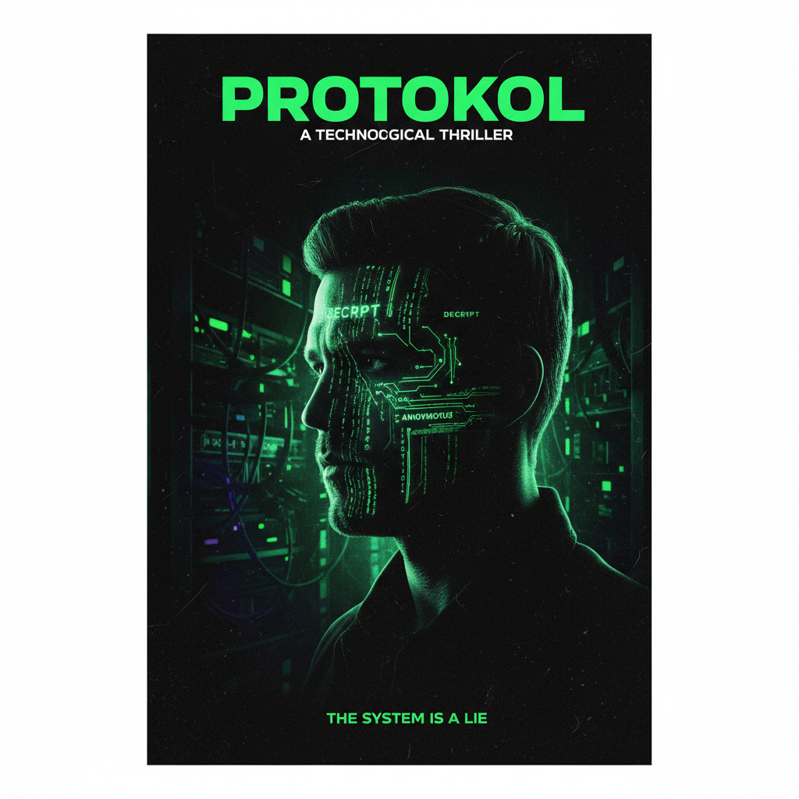

# CÓDIGO SOMBRA: Um Mistério Gerado por IA

## 📒 Descrição
Este projeto explora o potencial das IAs Generativas para a criação de conteúdo de entretenimento. O objetivo foi desenvolver o conceito, o roteiro e a arte de um curta-metragem de suspense chamado "Código Sombra". A história segue um programador que descobre uma conspiração ao encontrar mensagens escondidas dentro do código-fonte de um software legado. Todo o processo criativo, desde a sinopse até a imagem de divulgação, foi conduzido com o auxílio de ferramentas de Inteligência Artificial.

## 🤖 Tecnologias Utilizadas
- **Google Gemini:** Utilizado para brainstorming de ideias, desenvolvimento da sinopse, criação dos personagens e geração do roteiro completo do curta-metragem.
- **Midjourney:** Empregado para criar a arte conceitual e o pôster de divulgação do filme, traduzindo a atmosfera de suspense e tecnologia da história em uma imagem impactante.

## 🧐 Processo de Criação
O projeto foi dividido em três etapas principais:

1.  **Conceituação (usando Gemini):** A primeira fase envolveu um diálogo com a IA para definir o gênero, o tema central e a sinopse da história. O prompt inicial foi: *"Gere 5 ideias para um curta-metragem de suspense envolvendo tecnologia e programação"*. A ideia de "mensagens ocultas em código legado" foi a escolhida.

2.  **Criação do Pôster (usando Midjourney):** Com a sinopse definida, o passo seguinte foi criar uma identidade visual. O prompt utilizado no Midjourney foi: *"movie poster, a man's silhouette in a dark room illuminated by computer code on his face, hacker, mystery, cinematic, neon green on black, photorealistic, 8k --ar 2:3"*. O objetivo era capturar a essência de um thriller tecnológico.

3.  **Roteirização (usando Gemini):** Por fim, a IA foi instruída a escrever o roteiro completo, com descrição de cenas, diálogos e ações. O prompt foi: *"Escreva um roteiro de curta-metragem de 5 páginas baseado na seguinte sinopse: [sinopse detalhada aqui]. O protagonista se chama Léo, um programador introvertido. O tom deve ser de suspense crescente, culminando em uma revelação chocante."*

## 🚀 Resultados



## Link para o Livro
[Código Sombra](https://gemini.google.com/share/6c12192b8971) 

###  Roteiro

# Código Sombra
*Roteiro por: Gemini*

> **Logline:** Um programador solitário descobre uma conspiração de vigilância escondida em um sistema legado e precisa decidir se arrisca sua vida para expor a verdade.

---

## Página 1

### CENA 1: INT. ESCRITÓRIO DE TI - NOITE

ESCURIDÃO. O único som é o ZUMBIDO suave dos servidores e o clique rítmico de um teclado.

A luz de um monitor ilumina o rosto de LÉO (30s), um programador de aparência cansada, com olheiras profundas. Sua mesa é um caos controlado: canecas de café vazias, embalagens de energéticos e post-its com anotações indecifráveis. Ele é o único no andar.

Ele encara milhares de linhas de um código arcaico, uma relíquia de outra era da programação. Um suspiro de frustração escapa dele.

**LÉO**
*(para si mesmo)*
> Quem diabos escreveu isso...?

Ele aperta "Enter". O sistema compila. Uma barra de progresso avança lentamente e... **FALHA**. Uma mensagem de erro genérica aparece.

**MENSAGEM NA TELA:**
> ERRO 0x88A: Falha na Sincronização de Dados.

Léo massageia as têmporas. Ele já viu esse erro uma dúzia de vezes hoje. Ele navega pelas linhas de código, seus dedos se movendo com uma memória muscular cansada.

Ele adiciona um bloco de código para registrar o erro em mais detalhes e executa o programa novamente. A mesma falha. Mas desta vez, o log de erro é diferente. Bizarro.

**LOG DE ERRO NA TELA:**
> Log: Sincronização falhou no módulo de usuários. Tentativa 1... Tentativa 2... Tentativa 3... Eles estão ouvindo.

Léo para. Ele se inclina para a tela, os olhos semicerrados. "Eles estão ouvindo"? Deve ser uma string de texto corrompida. Lixo de memória. Ele ignora, apaga a linha e tenta uma abordagem diferente.

Ele roda o programa mais uma vez. Desta vez, um módulo diferente falha.

**MENSAGEM NA TELA:**
> ERRO 0x5C1: Ponteiro Nulo na Função de Validação.

Ele abre o log correspondente.

**LOG DE ERRO NA TELA:**
> Log: Validação falhou. A entrada não é segura. NÃO CONFIE EM NINGUÉM. O código tem olhos.

Um arrepio percorre a espinha de Léo. Isso não é aleatório. Não pode ser. Alguém colocou essas mensagens aqui.

Ele olha ao redor do escritório vazio e escuro. O som do ar condicionado de repente parece alto demais. Por um instante, ele sente que não está sozinho.

---

## Página 2

### CENA 2: INT. ESCRITÓRIO DE TI - CONTINUAÇÃO

A curiosidade vence o cansaço. Léo começa a caçar. Ele não está mais consertando o bug; está investigando um fantasma.

Ele pesquisa no código por palavras-chave das mensagens: "ouvindo", "olhos", "confie". Nada. O código está limpo.

Ele pensa por um momento. Como esconder uma mensagem? Ele decide procurar por blocos de comentários extensos, lugares onde os desenvolvedores deixam notas.

Ele encontra um, uma seção enorme de código "comentada" – inativa – com a nota de um antigo desenvolvedor.

**COMENTÁRIO NO CÓDIGO:**
```
// Módulo de otimização de cache desativado em 12/05/2011 por H. Almeida. Causa instabilidade. Não reativar.
```

H. Almeida. Léo busca por esse nome nos arquivos de log antigos da empresa. Ele encontra o nome: Hélio Almeida. Um desenvolvedor sênior que deixou a empresa há mais de uma década.

Léo volta para o bloco de código comentado. É enorme, quase mil linhas. Por que comentar tanto código em vez de simplesmente deletá-lo?

Ele começa a rolar o código inativo. Linha após linha de lógica complexa, mas inofensiva. Ele está prestes a desistir quando algo chama sua atenção.

No meio do bloco, uma única linha se destaca. Não é código. É uma frase.

**COMENTÁRIO NO CÓDIGO:**
```
// Se você achou isso, não foi um acidente. Eles me forçaram.
```

O coração de Léo dispara. Ele continua rolando, freneticamente. Mais abaixo, outra linha.

**COMENTÁRIO NO CÓDIGO:**
```
// Eles o chamam de 'Código Sombra'.
```

Código Sombra.

Léo digita "Código Sombra" na busca global do projeto. O computador processa por um segundo e retorna: NENHUM RESULTADO.

Claro que não seria tão fácil. Hélio o escondeu melhor do que isso.

Ele nota que a primeira letra de cada palavra na primeira mensagem de Hélio forma uma sigla: SVAINF. Não significa nada.

Ele tenta de novo. A última letra de cada palavra. OUIOUMTE. Também nada.

Sua mente está a mil. Ele olha para o nome do desenvolvedor: H. Almeida. E se...?

Ele procura no código por variáveis ou funções que usem essas iniciais. Ele encontra uma função obscura e raramente usada: `executeHexAlpha()`.

Hesitante, ele abre o arquivo da função.

---

## Página 3

### CENA 3: INT. ESCRITÓRIO DE TI - CONTINUAÇÃO

A função `executeHexAlpha()` é um pesadelo de ofuscação. Variáveis com nomes sem sentido, lógica que se dobra sobre si mesma. É projetada para não ser compreendida.

Léo passa quase uma hora decifrando-a. Ele percebe que a função não faz o que seu nome sugere. É uma fachada. Ela, na verdade, decodifica e executa um arquivo binário escondido nos recursos do sistema.

Um arquivo chamado `umbra.dat`. "Umbra" é latim para "sombra".

Léo sente uma mistura de medo e excitação. Ele está no caminho certo. Ele encontra o arquivo. É pequeno, mas criptografado.

A chave de criptografia deve estar em algum lugar. Ele volta para os comentários de Hélio.

**COMENTÁRIO NO CÓDIGO:**
```
// Módulo de otimização de cache desativado em 12/05/2011 por H. Almeida. Causa instabilidade. Não reativar.
```

A data. 12/05/2011.

Ele usa a sequência de números `12052011` como a chave para descriptografar o arquivo `umbra.dat`.

A descriptografia funciona. O conteúdo do arquivo aparece na tela.

Não é código de programação. É um manifesto. Um diário de bordo aterrorizado de Hélio Almeida.

**TEXTO NA TELA (FRAGMENTOS):**
> ...eles disseram que era para segurança nacional. Uma ferramenta de monitoramento passivo...
>
> ...mas a lista de alvos... não são criminosos. São jornalistas, juízes, ativistas...
>
> ...o Código Sombra não é passivo. Ele pode acessar microfones. Webcams. Registra cada tecla digitada...
>
> ...tentei sair. Eles mostraram fotos da minha filha na escola. Eu não posso parar. Mas posso deixar um aviso...
>
> ...escondi um interruptor. Uma forma de desativar tudo. Está atrelado ao relógio do sistema. Para ativá-lo, é preciso saber o meu maior arrependimento...

A última entrada é a mais arrepiante.

**TEXTO NA TELA:**
> ...eles sabem que deixei estas migalhas. Estão vindo atrás de mim. Se você está lendo isso, estão vindo atrás de você também. Destrua tudo.

De repente, as LUZES do andar inteiro piscam e se apagam, mergulhando Léo na escuridão total, exceto pelo brilho de seu monitor.

---

## Página 4

### CENA 4: INT. ESCRITÓRIO DE TI - CONTINUAÇÃO

Léo congela. Seu fôlego fica preso na garganta. O silêncio é absoluto.

As luzes de emergência se acendem, lançando sombras longas e distorcidas pelo escritório.

Ele se vira lentamente, examinando as baias vazias. Não há ninguém. Foi apenas uma queda de energia. Tinha que ser.

Ele volta para o monitor, as mãos tremendo. Destruir tudo. Como?

"O meu maior arrependimento..."

O que isso significa? Uma senha?

Ele pensa em Hélio. Um homem encurralado, com medo pela sua família. Seu maior arrependimento...

Léo olha para a data novamente. 12/05/2011. A data em que ele desativou o código comentado e escondeu a primeira pista. O dia em que ele se tornou cúmplice.

Ele abre a função principal do "Código Sombra". Ele encontra uma verificação lógica, um `if` que nunca seria acionado sob condições normais.

```java
if (system.password == "???") { 
    disable_all(); 
}
```

Ele digita a data no campo da senha: `12052011`. Pressiona Enter. NADA.

Ele tenta variações: `12/05/2011`, `doze_maio_2011`. NADA.

Não é a data. O que Hélio se arrependeu? De ter criado o código. De ter cedido.

Ele olha para o nome do arquivo: `umbra.dat`.

Ele digita `UMBRA`. NADA.

Ele digita `CÓDIGO SOMBRA`. NADA.

Ele está desesperado. Ele olha para o manifesto de Hélio. Para as fotos da filha. O arrependimento não era o código. Era o preço. A família.

Léo não sabe o nome da filha de Hélio. Ele não tem como saber. É um beco sem saída.

Ele está prestes a desistir, a simplesmente desligar o computador e esquecer tudo, quando algo em sua tela muda.

A janela do seu editor de código se minimiza sozinha.

Seu protetor de tela – uma paisagem tranquila – é substituído por uma imagem ao vivo.

É a câmera de segurança do corredor do lado de fora do escritório. A imagem está granulada, em preto e branco. O corredor está vazio.

Léo observa, paralisado.

Então, a porta do elevador no final do corredor se abre.

Dois HOMENS de terno escuro saem. Eles não se parecem com funcionários. Seus movimentos são calmos, deliberados. Eles olham diretamente para a câmera de segurança por um momento antes de começarem a andar pelo corredor.

Em direção ao escritório de TI.

Em direção a ele.

---

## Página 5

### CENA 5: INT. ESCRITÓRIO DE TI - CONTINUAÇÃO

PÂNICO.

Léo se levanta abruptly, a cadeira rolando para trás. Ele olha para a porta do seu escritório, depois de volta para a tela. Os homens estão se aproximando.

Ele precisa agir. Destruir. Expor. Correr.

Seu cursor paira sobre o botão para desconectar da rede. Mas se ele fizer isso, perderá a chance de desativar o programa.

Ele volta para o campo de senha. "O maior arrependimento".

O manifesto. Hélio escreveu: "Eles disseram que era para segurança nacional". Foi a mentira que ele aceitou. A justificativa.

Com os dedos trêmulos, ele digita.

**LÉO**
*(sussurrando)*
> Segurança...

Ele digita a palavra: `SEGURANÇA`.

Pressiona Enter.

Por um segundo, nada acontece. Então, o código na tela começa a se apagar. Linha por linha, funções inteiras desaparecendo em nanossegundos. O "Código Sombra" está se autodestruindo.

Um sorriso de alívio e triunfo surge no rosto de Léo. Ele conseguiu.

A imagem da câmera de segurança pisca e morre.

A tela do seu computador fica preta.

Então, um novo texto aparece. Digitado lentamente, letra por letra, por um remetente desconhecido.

**MENSAGEM NA TELA:**
> Belo truque.

O coração de Léo afunda.

**MENSAGEM NA TELA:**
> Acha que Hélio foi o único que deixou um backdoor?

O som da maçaneta da porta do escritório girando. CLIQUE.

Léo se vira lentamente para a porta.

A porta se abre. Uma silhueta escura se recorta contra a luz de emergência do corredor.

**CLOSE** no rosto de Léo. O terror absoluto toma conta de seus olhos. Ele não desvendou a conspiração. Ele apenas bateu na porta dela.

**FADE TO BLACK.**

**FIM**
